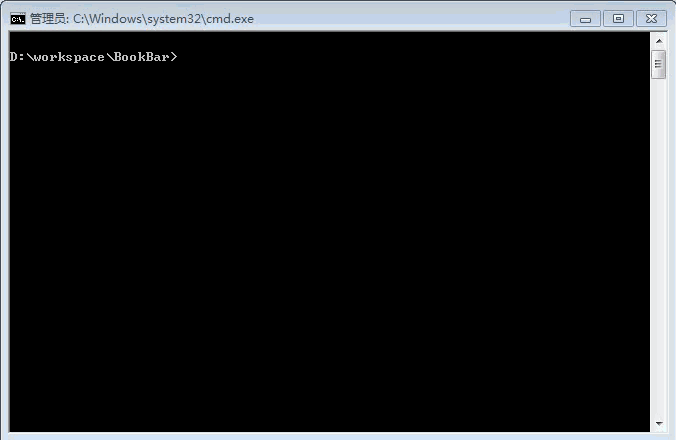

# BookBar
读书进度条，未完成 - 《程序员的自我修养》 [■■■■■■□□□□□□□□□□□□□□] [100/300 | 33.3%]

## 简介
这是一个很简单的小工具，用于管理你的读书进度。

以进度条的方式展示读书进度。

## 如何使用
### step 1：下载项目
```git clone https://github.com/windcode/BookBar.git```

### step 2：命令行运行bar.py


## 已完成特性
* 进度条展示
* 书本的添加
* 书本的更新

## 未完成特性
* 书本的删除
* 优美的进度条
* 自动导入图书信息。（爬取当当书本简介页）例如添加《暗时间》时，如果找到这本书的目录信息，应用将会自动建立进度条。

## 注意
测试环境为windows
